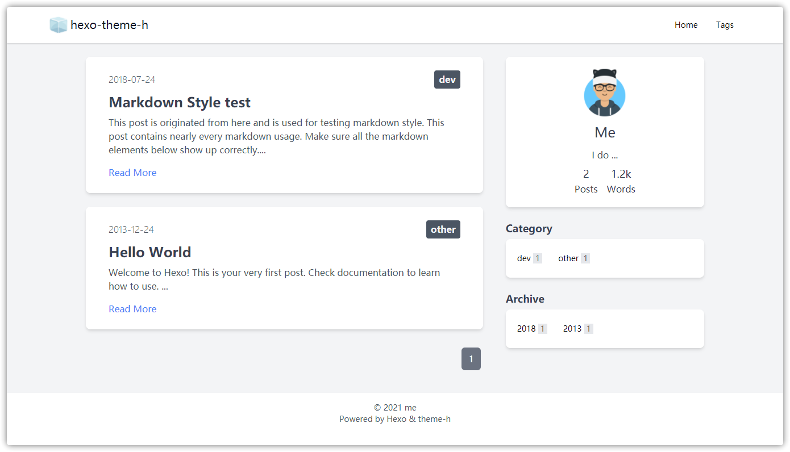

# hexo-theme-h 氢

中文 | [English](https://github.com/0x2E/hexo-theme-h/blob/main/README_en.md)

**theme-h** 是一个真诚、纯粹的 Hexo 主题。如同 H 是元素周期表中最轻的元素，theme-h 没有复杂的配色和修饰，它只想为你的内容提供一个朴素的容器。设计灵感来自 [@khatabwedaa](https://tailwindcomponents.com/u/khatabwedaa)。

个人精力有限，本项目仅不定期维护，不接受新功能需求。欢迎 fork 并发展出新的版本。



## 必要的配置

修改站点的 `_config.yml` 的如下配置：

- 关闭 highlight

```yaml
highlight:
  enable: false
```

- 开启 prismjs 并关闭行号

```yaml
prismjs:
  enable: true
  line_number: false
```

## 其他配置

### 评论

在配置中设置 `comment: true`，然后填入评论所需代码，以下方式任选：

- 保存到 `layout\_widgets\comments.ejs` 中

- 如果你的评论代码是 JS 通过选择器定向插入 HTML 代码来实现的，则可以将选择器设置为 `#comments`，然后使用 [Hexo 注入器](https://hexo.io/zh-cn/api/injector.html) 将 JS 代码插入进页面

### 站点统计

没有预留配置项，建议使用 [Hexo 注入器](https://hexo.io/zh-cn/api/injector.html) 将代码插入页面

## 开发

1. 使用 yarn 或 npm 安装依赖

2. 将 `tailwind.config.js` 中的 `purge.enabled` 属性改为 `false`，这将关闭 tailwindcss 的清理功能，方便开发

3. 执行 `yarn run css`，如果你已在上一步中关闭了清理功能，这条命令将编译出一个巨大的 CSS 文件，其中包含 tailwindcss 的所有样式。在此之后对 ejs 文件修改样式时不需要再编译了，但修改 `src/main.css` 后仍需要编译

4. 将第 2 步中关闭的清理功能重新开启，执行 `yarn run css` 编译出最终 CSS 文件
